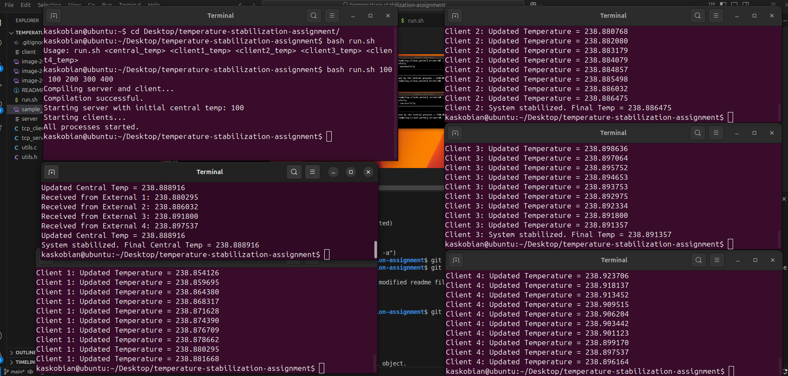

# Temperature Stabilization System – README

## Overview

This project implements a **temperature stabilization system** using **TCP socket communication** between a central process and four external processes.

* **Central process:** Receives temperatures from external processes, calculates the new central temperature, and sends updates back.
* **External processes:** Each external process sends its current temperature to the central process and updates its temperature based on the central process reply.
* The system iterates until **all temperatures converge within a defined tolerance** (`EPS = 1e-3`).

---

## Processes & Communication

* **Total processes:** 5

  * 1 central process
  * 4 external processes (clients)
* **Communication:** TCP sockets on localhost (`127.0.0.1`)
* **Temperature formulas:**

**External process update:**

```
externalTemp ← (3 * externalTemp + 2 * centralTemp) / 5
```

**Central process update:**

```
centralTemp ← (2 * centralTemp + sum(externalTemps)) / 6
```

* Processes continue to exchange messages until convergence.
* Central process sends a **“done” signal** to indicate stabilization.

---

## Compilation Instructions

```bash
gcc utils.c tcp_server.c -o server
gcc utils.c tcp_client.c -o client
```

---

## Running the System

1. **Start the server** (central process):

```bash
./server <initial_central_temperature>
```

2. **Start each external process** (client) in a separate terminal:

```bash
./client 1 <initial_temp1>
./client 2 <initial_temp2>
./client 3 <initial_temp3>
./client 4 <initial_temp4>
```

**Example:**

```bash
./server 100
./client 1 100
./client 2 200
./client 3 300
./client 4 400
```

* Each terminal will display the current temperatures and updates.
* The system prints the **final stabilized temperature** when convergence is reached.

---
## Run all the things in one go

You can run the whole temperature-stabilization system by executing the `run.sh` script.  
This script will:

1. Compile both the **server** and **client** programs.
2. Launch the **server** in the new terminal.
3. Launch the **four clients** in separate terminals, each with its respective initial temperature.

### Usage

```bash
./run.sh <central_temp> <client1_temp> <client2_temp> <client3_temp> <client4_temp>
```
---
## Screenshots

* Include **screenshots of all five terminals running** and the final stabilization message.
* Save images in your repo (e.g., `screenshots/`) and reference them in the README:

